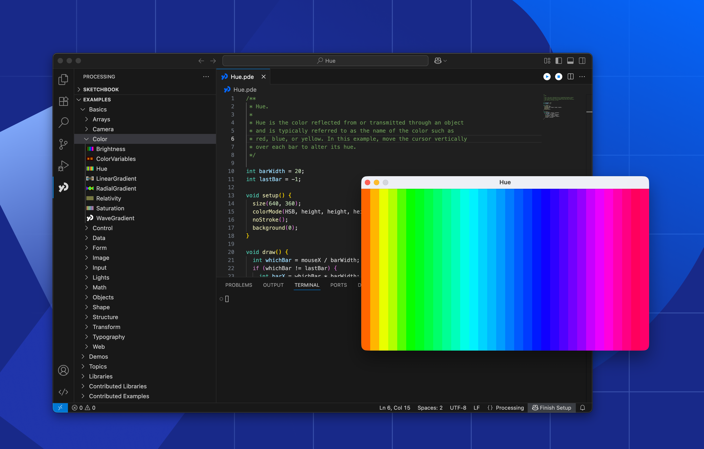

# Processing VSCode Extension

<!-- TODO: Generate grammar based on the installed Processing version -->
<!-- TODO: Setup publishing https://code.visualstudio.com/api/working-with-extensions/publishing-extension  -->

<!-- TODO: add a link to the extension Marketplace page -->

This extension provides support for the Processing programming language in Visual Studio Code.

With familiar run and stop buttons, syntax highlighting, and other helpful features like code suggestions, this extension is designed to support creative coding with Processing for people who prefer using Visual Studio Code as their code editor of choice.

## Requirements
To use this extension, you need to have the **release of Processing (4.4.6+)** installed on your system. You can download it from this link: [Processing](https://processing.org).

> [!IMPORTANT]
> **Make sure to run Processing 4.4.6 at least once** before using the extension. This step is needed to initialize some required files.

## Features
- ▶️ Run / Stop buttons: Play your sketch directly in VS Code.
- 📁 Sketchbook & Examples Explorer: Browse and open sketches easily.
- 🎨 Syntax Highlighting: Color-coded formatting for Processing functions and variables.
- 💡 Code suggestions & error checking: Powered by Processing’s Language Server.
- 🛠️ No setup required: The extension auto-detects your Processing install.

## How to Use
To use the Processing VSCode extension, follow these steps:

1. Install Processing 4.4.6 or later
2. Open a `.pde` file or use the sketchbook/explorer in VS Code.
3. Press ▶️ to run your sketch!

## Troubleshooting
If you encounter any issues with the Processing VSCode extension, try the following steps:

- Restart VS Code.
- Make sure no other Processing extensions are installed in VSCode.
- Quit any running instances of Processing.
- Double-check that you're using the correct version of Processing (4.4.76).
- Try running the Processing app once before opening VS Code.

## Compatibility
This extension has been tested on the following platforms:

- ✅ macOS (Apple Silicon)
- ✅ Windows 64-bit
- ✅ Linux 64-bit

## Known issues
- Play/Stop buttons don’t reflect the actual running state yet.
- Syntax highlighting for Processing-specific constants (e.g., `PI`, `RGB`, `DEGREES`, etc) is not yet implemented.
- Classes imported from third-party libraries are not recognized by the language server, leading to line errors (the sketch will still run correctly) see issue [#9](https://github.com/Stefterv/processing4-vscode-extension/issues/9).

## Contributing
This extension is still in development, and you’re welcome to help!

> [!NOTE]
> Before opening a pull request, it's usually a good idea to start a conversation in the related issue or open a new one. This gives us a chance to talk through the idea together, point you to relevant parts of the code or documentation, and help make your contribution smoother and more likely to be accepted.

1. Fork the repository
2. Clone your fork
3. Create a new branch
4. Make your changes
5. Test your changes locally
6. Commit your changes (use a descriptive commit message)
7. Push to your fork and open a pull request

## License
This project is licensed under the GPL-2.0 License. See the [LICENSE](LICENSE.md) file for details.

For information about Processing's own licensing, please refer to the Processing [README](https://github.com/processing/processing4?tab=readme-ov-file) file.